# UI Ideas

A collection of Telikom homepage design explorations with responsive full-page screenshots.

Run **Actions → Capture Responsive Design Screenshots → Run workflow** whenever you want to refresh the screenshots. The workflow regenerates every viewport, updates this gallery automatically, creates a ZIP, and commits the results back to `main`.

[Download the latest committed screenshot ZIP](./screenshot-archives/ui-ideas-screenshots.zip)

## Screenshot sizes

Every top-level numbered design is captured as a **full-page screenshot** at:

- Desktop 1920 × 1080
- Desktop 1440 × 900
- Laptop 1366 × 768
- Tablet landscape 1024 × 768
- Tablet portrait 768 × 1024
- Large mobile 430 × 932
- Mobile 390 × 844
- Small mobile 360 × 800

The screenshots use high-quality JPEG output to keep the full responsive set and ZIP reasonably sized for the repository.

<!-- DESIGN_GALLERY_START -->

## Design Gallery

Run the screenshot action once to populate these previews. After that, this section is regenerated automatically from the numbered HTML designs and includes links to every responsive capture.

### Design 1
[Open HTML design](./1.html)

[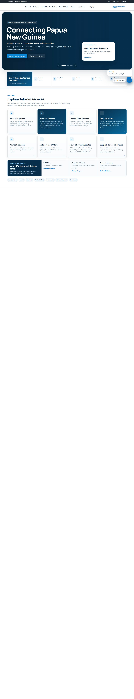](./screenshots/desktop-1440/1.jpg)

### Design 2
[Open HTML design](./2.html)

### Design 3
[Open HTML design](./3.html)

[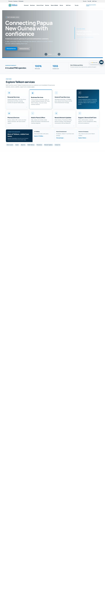](./screenshots/desktop-1440/3.jpg)

### Design 4
[Open HTML design](./4.html)

[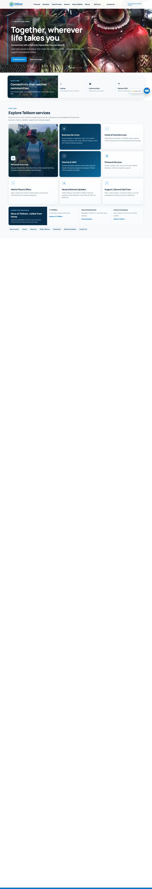](./screenshots/desktop-1440/4.jpg)

### Design 5
[Open HTML design](./5.html)

[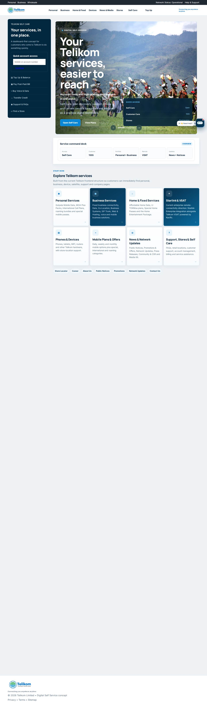](./screenshots/desktop-1440/5.jpg)

### Design 6
[Open HTML design](./6.html)

[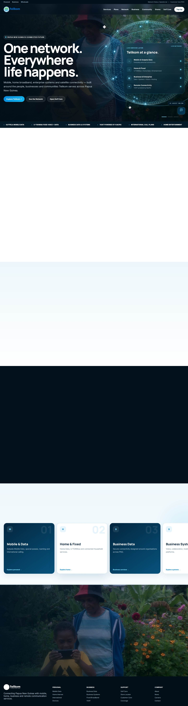](./screenshots/desktop-1440/6.jpg)

### Design 7
[Open HTML design](./7.html)

[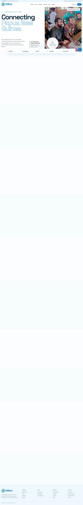](./screenshots/desktop-1440/7.jpg)

### Design 8
[Open HTML design](./8.html)

[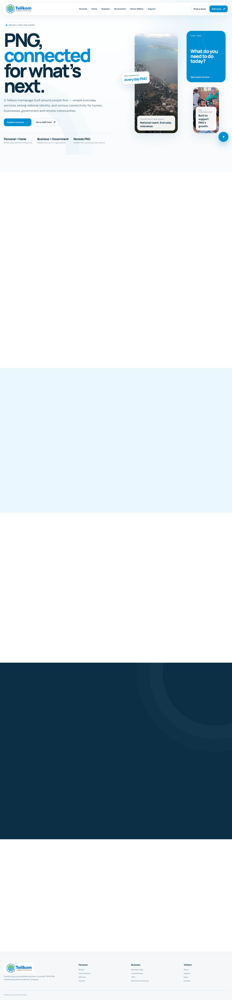](./screenshots/desktop-1440/8.jpg)

### Design 9
[Open HTML design](./9.html)

[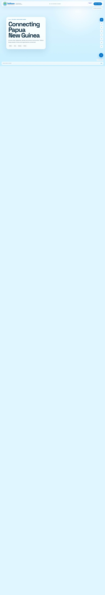](./screenshots/desktop-1440/9.jpg)

### Design 10
[Open HTML design](./10.html)

[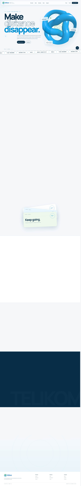](./screenshots/desktop-1440/10.jpg)

### Design 11
[Open HTML design](./11.html)

[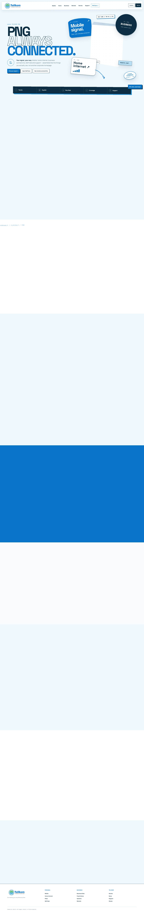](./screenshots/desktop-1440/11.jpg)

### Design 12
[Open HTML design](./12.html)

[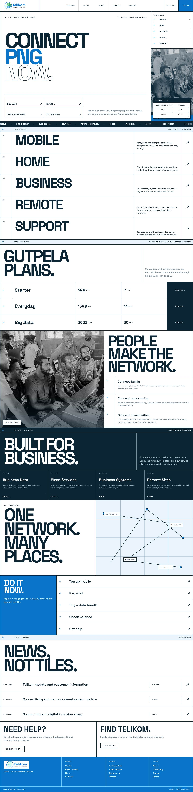](./screenshots/desktop-1440/12.jpg)

### Design 13
[Open HTML design](./13.html)

[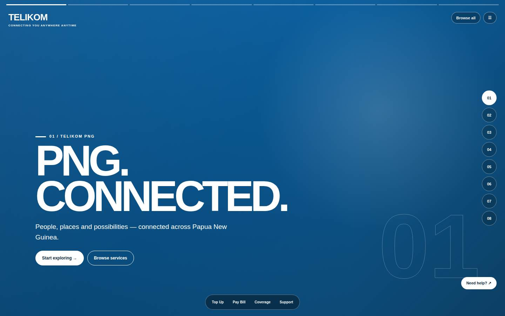](./screenshots/desktop-1440/13.jpg)

### Design 14
[Open HTML design](./14.html)

[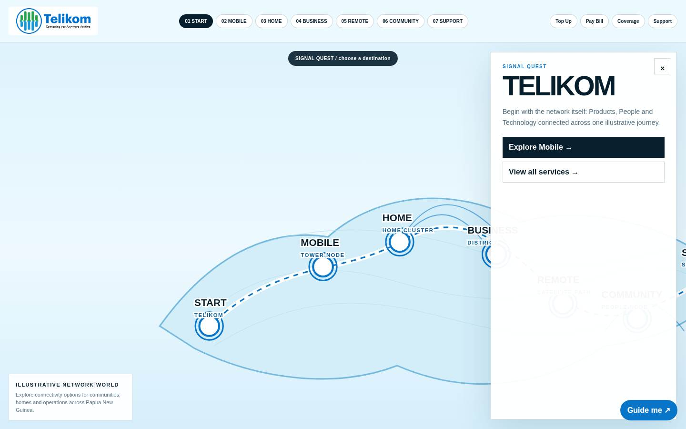](./screenshots/desktop-1440/14.jpg)

### Design 15
[Open HTML design](./15.html)

[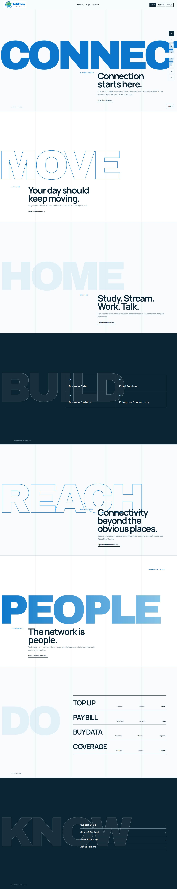](./screenshots/desktop-1440/15.jpg)

### Design 16
[Open HTML design](./16.html)

[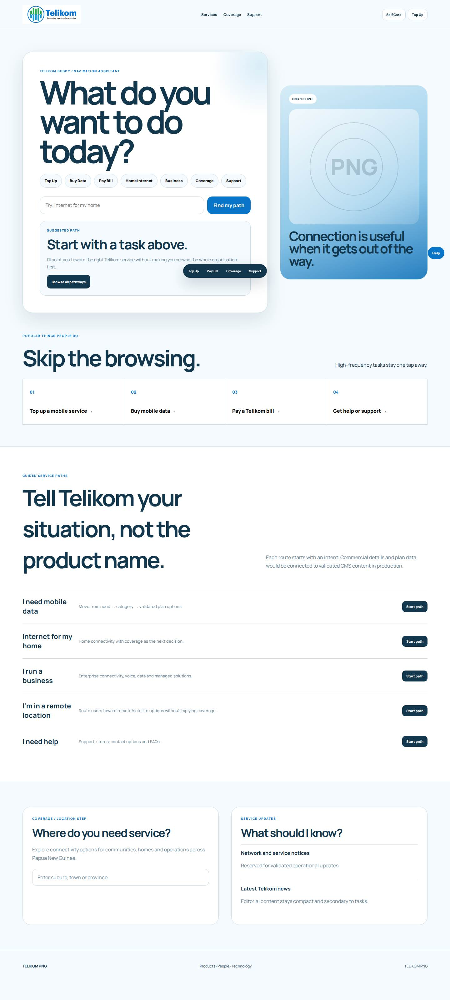](./screenshots/desktop-1440/16.jpg)

### Design 17
[Open HTML design](./17.html)

[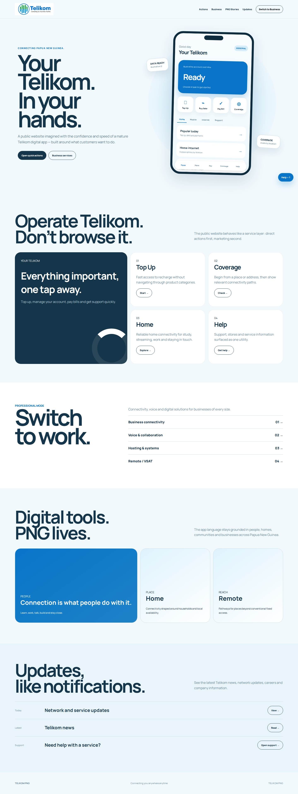](./screenshots/desktop-1440/17.jpg)

### Design 18
[Open HTML design](./18.html)

[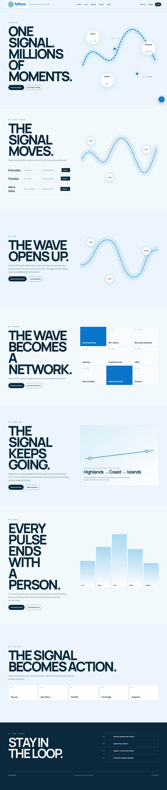](./screenshots/desktop-1440/18.jpg)

### Design 19
[Open HTML design](./19.html)

[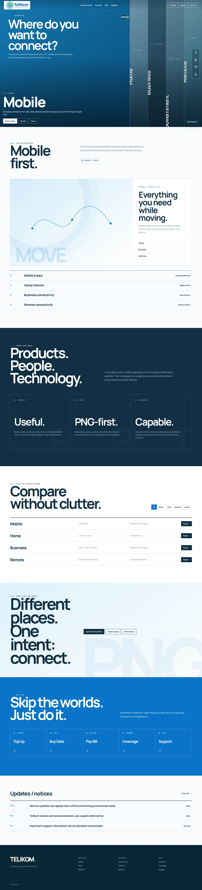](./screenshots/desktop-1440/19.jpg)

### Design 20
[Open HTML design](./20.html)

[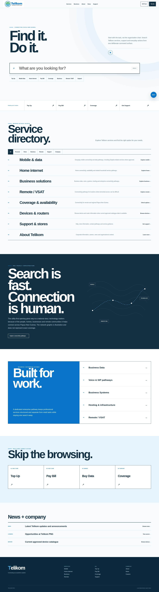](./screenshots/desktop-1440/20.jpg)

### Design 21
[Open HTML design](./21.html)

[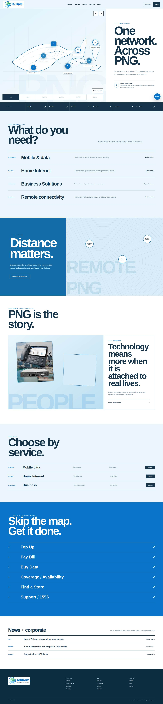](./screenshots/desktop-1440/21.jpg)

<!-- DESIGN_GALLERY_END -->
