# UI Ideas

<!-- WEBSITE_PATTERN_RESEARCH_START -->

## Website Pattern Research

> Auto-generated from clean screenshot inventory + semantic JSON. Failed, partial, blocked and unreliable captures are excluded from the atlas and research statistics.

**45 clean reference screenshots tracked · 45 semantically analyzed · 15 captures excluded**

[Open the all-reference atlas](./research/website-patterns/generated/all-reference-atlas.jpg) · [Final decided structure](./research/website-patterns/generated/final-structure-recommendation.json) · [All cohort summaries](./research/website-patterns/generated/all-cohorts-summary.json)

### Final decided page structure

This is the project-approved homepage information architecture. It is shown without research-derived percentages.

| Order | Section |
| ---: | --- |
| 1 | Header |
| 2 | Hero |
| 3 | Quick Actions |
| 4 | Offers / Plans |
| 5 | Service Categories |
| 6 | Business & Government |
| 7 | PNG / National Story |
| 8 | Notices & News |
| 9 | Help / Support / Stores |
| 10 | Footer |

### Analysis coverage

| Cohort | Candidates | Included clean captures | Excluded captures | Analyzed | Pending |
| --- | ---: | ---: | ---: | ---: | ---: |
| Modern Telecom Cohort | 9 | 8 | 1 | 8 | 0 |
| PNG Private-Sector Familiarity Cohort | 31 | 25 | 6 | 25 | 0 |
| PNG Public-Service Familiarity Cohort | 20 | 12 | 8 | 12 | 0 |

### Modern Telecom Cohort

**8 clean screenshots · 8 analyzed · 1 excluded · 0 pending**

[Open cohort atlas](./research/website-patterns/generated/modern-telecom-atlas.jpg) · [Summary JSON](./research/website-patterns/generated/modern-telecom-summary.json) · [Observed structure CSV](./research/website-patterns/generated/modern-telecom-recommended-structure.csv) · [Transitions CSV](./research/website-patterns/generated/modern-telecom-transitions.csv)

**Observed section pattern at each page position**

| Position | Most common observed section | Sites at this exact position |
| ---: | --- | ---: |
| 1 | Navigation / Header | 8/8 (100%) |
| 2 | Hero / Banner + CTA | 8/8 (100%) |
| 3 | Quick Actions / Self-Service | 3/8 (38%) |
| 4 | Product / Offer Cards | 3/8 (38%) |
| 5 | Device Promotion | 2/8 (25%) |
| 6 | News / Updates | 3/8 (38%) |
| 7 | Footer | 4/8 (50%) |
| 8 | Footer | 4/8 (50%) |

**Section presence across clean analyzed sites**

| Pattern | Analyzed sites | Coverage |
| --- | ---: | ---: |
| Footer | 8/8 | 100% |
| Hero / Banner + CTA | 8/8 | 100% |
| Navigation / Header | 8/8 | 100% |
| Product / Offer Cards | 5/8 | 62% |
| Editorial / Explainer | 4/8 | 50% |
| Plans / Pricing | 4/8 | 50% |
| Quick Actions / Self-Service | 4/8 | 50% |
| Business / Enterprise | 3/8 | 38% |
| Device Promotion | 3/8 | 38% |
| Help / FAQ / Support | 3/8 | 38% |
| News / Updates | 3/8 | 38% |
| Trust / Stats / Proof | 3/8 | 38% |
| App / Digital Experience | 2/8 | 25% |
| Services / Categories | 2/8 | 25% |

**Most common page-flow transitions**

| Transition | Count |
| --- | ---: |
| Navigation / Header → Hero / Banner + CTA | 8 |
| Product / Offer Cards → Plans / Pricing | 4 |
| Plans / Pricing → Device Promotion | 3 |
| Help / FAQ / Support → Footer | 3 |
| Hero / Banner + CTA → Quick Actions / Self-Service | 3 |
| Quick Actions / Self-Service → Product / Offer Cards | 3 |
| Hero / Banner + CTA → Editorial / Explainer | 3 |
| News / Updates → Footer | 3 |

**Excluded capture attempts**

| Site | Reason |
| --- | --- |
| Vodafone Papua New Guinea | Capture metadata status: partial |

### PNG Private-Sector Familiarity Cohort

**25 clean screenshots · 25 analyzed · 6 excluded · 0 pending**

[Open cohort atlas](./research/website-patterns/generated/png-private-sector-atlas.jpg) · [Summary JSON](./research/website-patterns/generated/png-private-sector-summary.json) · [Observed structure CSV](./research/website-patterns/generated/png-private-sector-recommended-structure.csv) · [Transitions CSV](./research/website-patterns/generated/png-private-sector-transitions.csv)

**Observed section pattern at each page position**

| Position | Most common observed section | Sites at this exact position |
| ---: | --- | ---: |
| 1 | Navigation / Header | 25/25 (100%) |
| 2 | Hero / Banner + CTA | 23/25 (92%) |
| 3 | Editorial / Explainer | 8/25 (32%) |
| 4 | Editorial / Explainer | 6/25 (24%) |
| 5 | Footer | 3/25 (12%) |
| 6 | Footer | 7/25 (28%) |
| 7 | Footer | 4/25 (16%) |
| 8 | Footer | 6/25 (24%) |
| 9 | Footer | 2/25 (8%) |
| 10 | Footer | 1/25 (4%) |

**Section presence across clean analyzed sites**

| Pattern | Analyzed sites | Coverage |
| --- | ---: | ---: |
| Footer | 25/25 | 100% |
| Navigation / Header | 25/25 | 100% |
| Hero / Banner + CTA | 23/25 | 92% |
| Editorial / Explainer | 18/25 | 72% |
| Services / Categories | 12/25 | 48% |
| Trust / Stats / Proof | 12/25 | 48% |
| News / Updates | 8/25 | 32% |
| Product / Offer Cards | 8/25 | 32% |
| Quick Actions / Self-Service | 8/25 | 32% |
| Form / Contact / Complaint | 5/25 | 20% |
| Projects / Initiatives | 5/25 | 20% |
| Business / Enterprise | 4/25 | 16% |
| Help / FAQ / Support | 3/25 | 12% |
| Online Service / Portal | 3/25 | 12% |
| App / Digital Experience | 2/25 | 8% |

**Most common page-flow transitions**

| Transition | Count |
| --- | ---: |
| Navigation / Header → Hero / Banner + CTA | 23 |
| Hero / Banner + CTA → Editorial / Explainer | 6 |
| Form / Contact / Complaint → Footer | 5 |
| Hero / Banner + CTA → Trust / Stats / Proof | 5 |
| Hero / Banner + CTA → Quick Actions / Self-Service | 4 |
| Trust / Stats / Proof → Footer | 4 |
| Trust / Stats / Proof → Editorial / Explainer | 4 |
| Editorial / Explainer → Trust / Stats / Proof | 4 |

**Excluded capture attempts**

| Site | Reason |
| --- | --- |
| Airways Hotel & Residences | Semantic capture status: partial |
| CPL Group | Semantic capture status: partial |
| Daltron PNG | Semantic capture status: partial |
| PNGworkForce | Semantic capture status: partial |
| RH Hypermarket / RH Trading PNG | Cloudflare 403 block during automated capture |
| Vision City Mega Mall | Semantic capture status: partial |

### PNG Public-Service Familiarity Cohort

**12 clean screenshots · 12 analyzed · 8 excluded · 0 pending**

[Open cohort atlas](./research/website-patterns/generated/png-public-services-atlas.jpg) · [Summary JSON](./research/website-patterns/generated/png-public-services-summary.json) · [Observed structure CSV](./research/website-patterns/generated/png-public-services-recommended-structure.csv) · [Transitions CSV](./research/website-patterns/generated/png-public-services-transitions.csv)

**Observed section pattern at each page position**

| Position | Most common observed section | Sites at this exact position |
| ---: | --- | ---: |
| 1 | Navigation / Header | 12/12 (100%) |
| 2 | Hero / Banner + CTA | 10/12 (83%) |
| 3 | Editorial / Explainer | 4/12 (33%) |
| 4 | Services / Categories | 2/12 (17%) |
| 5 | News / Updates | 3/12 (25%) |
| 6 | Footer | 2/12 (17%) |
| 7 | Form / Contact / Complaint | 2/12 (17%) |
| 8 | Footer | 2/12 (17%) |
| 9 | Regulatory Information | 1/12 (8%) |
| 10 | Help / FAQ / Support | 1/12 (8%) |
| 11 | Footer | 1/12 (8%) |

**Section presence across clean analyzed sites**

| Pattern | Analyzed sites | Coverage |
| --- | ---: | ---: |
| Navigation / Header | 12/12 | 100% |
| Footer | 10/12 | 83% |
| Hero / Banner + CTA | 10/12 | 83% |
| News / Updates | 6/12 | 50% |
| Editorial / Explainer | 5/12 | 42% |
| Services / Categories | 5/12 | 42% |
| Notices / Alerts | 4/12 | 33% |
| Quick Actions / Self-Service | 4/12 | 33% |
| Form / Contact / Complaint | 3/12 | 25% |
| Projects / Initiatives | 3/12 | 25% |
| Trust / Stats / Proof | 3/12 | 25% |
| Online Service / Portal | 2/12 | 17% |
| Regulatory Information | 2/12 | 17% |
| Guidance / Safety | 1/12 | 8% |
| Help / FAQ / Support | 1/12 | 8% |

**Most common page-flow transitions**

| Transition | Count |
| --- | ---: |
| Navigation / Header → Hero / Banner + CTA | 10 |
| Hero / Banner + CTA → Services / Categories | 3 |
| Hero / Banner + CTA → Editorial / Explainer | 3 |
| Trust / Stats / Proof → News / Updates | 3 |
| Editorial / Explainer → Services / Categories | 2 |
| Hero / Banner + CTA → Quick Actions / Self-Service | 2 |
| News / Updates → Projects / Initiatives | 2 |
| Editorial / Explainer → Footer | 2 |

**Excluded capture attempts**

| Site | Reason |
| --- | --- |
| Department of Higher Education Research Science and Technology | Semantic capture status: partial |
| National Department of Education | Semantic capture status: partial |
| National Department of Health | Semantic capture status: partial |
| Immigration & Citizenship Authority | Semantic capture status: partial |
| Internal Revenue Commission | Semantic capture status: partial |
| National Capital District Commission | Semantic capture status: partial |
| University of Goroka | Semantic capture status: partial |
| University of Papua New Guinea | Semantic capture status: partial |

<!-- WEBSITE_PATTERN_RESEARCH_END -->

A collection of Telikom homepage design explorations with responsive full-page screenshots.

Run **Actions → Capture Responsive Design Screenshots → Run workflow** whenever you want to refresh the screenshots. The workflow regenerates every viewport, updates this gallery automatically, creates a ZIP, and commits the results back to `main`.

[Download the latest committed screenshot ZIP](./screenshot-archives/ui-ideas-screenshots.zip)

## Screenshot sizes

Every top-level numbered design is captured as a **full-page screenshot** at:

- Desktop 1920 × 1080
- Desktop 1440 × 900
- Laptop 1366 × 768
- Tablet landscape 1024 × 768
- Tablet portrait 768 × 1024
- Large mobile 430 × 932
- Mobile 390 × 844
- Small mobile 360 × 800

The screenshots use high-quality JPEG output to keep the full responsive set and ZIP reasonably sized for the repository.

<!-- DESIGN_GALLERY_START -->

## Design Gallery

Generated from 34 top-level design page(s).

### Design 1

[Open HTML design](./1.html)

[desktop-1440](./screenshots/desktop-1440/1.jpg)

### Design 2

[Open HTML design](./2.html)

### Design 3

[Open HTML design](./3.html)

[desktop-1440](./screenshots/desktop-1440/3.jpg)

### Design 4

[Open HTML design](./4.html)

[desktop-1440](./screenshots/desktop-1440/4.jpg)

### Design 5

[Open HTML design](./5.html)

[desktop-1440](./screenshots/desktop-1440/5.jpg)

### Design 6

[Open HTML design](./6.html)

[desktop-1440](./screenshots/desktop-1440/6.jpg)

### Design 7

[Open HTML design](./7.html)

[desktop-1440](./screenshots/desktop-1440/7.jpg)

### Design 8

[Open HTML design](./8.html)

[desktop-1440](./screenshots/desktop-1440/8.jpg)

### Design 9

[Open HTML design](./9.html)

[desktop-1440](./screenshots/desktop-1440/9.jpg)

### Design 10

[Open HTML design](./10.html)

[desktop-1440](./screenshots/desktop-1440/10.jpg)

### Design 11

[Open HTML design](./11.html)

[desktop-1440](./screenshots/desktop-1440/11.jpg)

### Design 12

[Open HTML design](./12.html)

[desktop-1440](./screenshots/desktop-1440/12.jpg)

### Design 13

[Open HTML design](./13.html)

[desktop-1440](./screenshots/desktop-1440/13.jpg)

### Design 14

[Open HTML design](./14.html)

[desktop-1440](./screenshots/desktop-1440/14.jpg)

### Design 15

[Open HTML design](./15.html)

[desktop-1440](./screenshots/desktop-1440/15.jpg)

### Design 16

[Open HTML design](./16.html)

[desktop-1440](./screenshots/desktop-1440/16.jpg)

### Design 17

[Open HTML design](./17.html)

[desktop-1440](./screenshots/desktop-1440/17.jpg)

### Design 18

[Open HTML design](./18.html)

[desktop-1440](./screenshots/desktop-1440/18.jpg)

### Design 19

[Open HTML design](./19.html)

[desktop-1440](./screenshots/desktop-1440/19.jpg)

### Design 20

[Open HTML design](./20.html)

[desktop-1440](./screenshots/desktop-1440/20.jpg)

### Design 21

[Open HTML design](./21.html)

[desktop-1440](./screenshots/desktop-1440/21.jpg)

### Design 22

[Open HTML design](./22.html)

[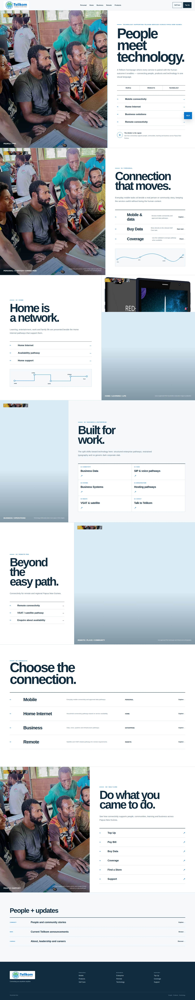](./screenshots/desktop-1440/22.jpg)

[desktop-1440](./screenshots/desktop-1440/22.jpg)

### Design 23

[Open HTML design](./23.html)

[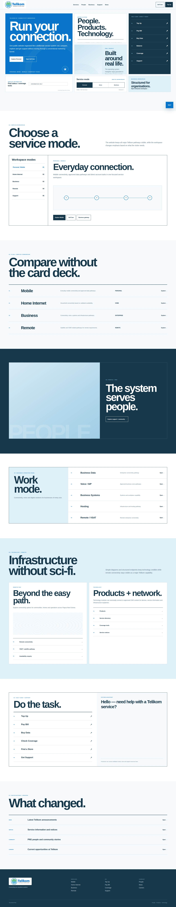](./screenshots/desktop-1440/23.jpg)

[desktop-1440](./screenshots/desktop-1440/23.jpg)

### Design 24

[Open HTML design](./24.html)

[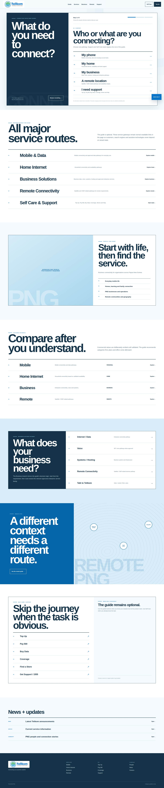](./screenshots/desktop-1440/24.jpg)

[desktop-1440](./screenshots/desktop-1440/24.jpg)

### Design 25

[Open HTML design](./25.html)

[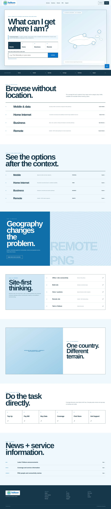](./screenshots/desktop-1440/25.jpg)

[desktop-1440](./screenshots/desktop-1440/25.jpg)

### Design 26

[Open HTML design](./26.html)

[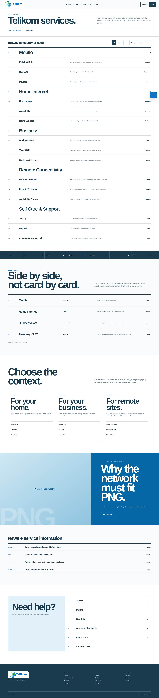](./screenshots/desktop-1440/26.jpg)

[desktop-1440](./screenshots/desktop-1440/26.jpg)

### Design 27

[Open HTML design](./27.html)

[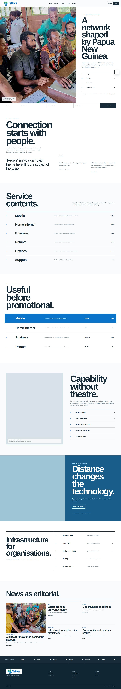](./screenshots/desktop-1440/27.jpg)

[desktop-1440](./screenshots/desktop-1440/27.jpg)

### Design 28

[Open HTML design](./28.html)

[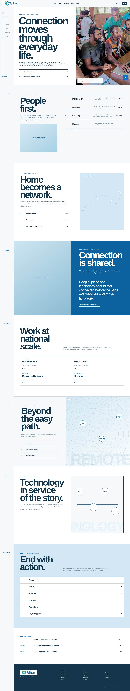](./screenshots/desktop-1440/28.jpg)

[desktop-1440](./screenshots/desktop-1440/28.jpg)

### Design 29

[Open HTML design](./29.html)

[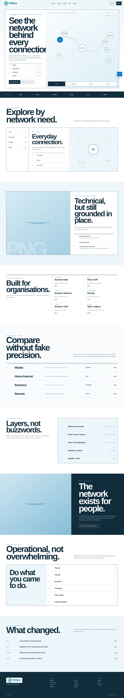](./screenshots/desktop-1440/29.jpg)

[desktop-1440](./screenshots/desktop-1440/29.jpg)

### Design 30

[Open HTML design](./30.html)

[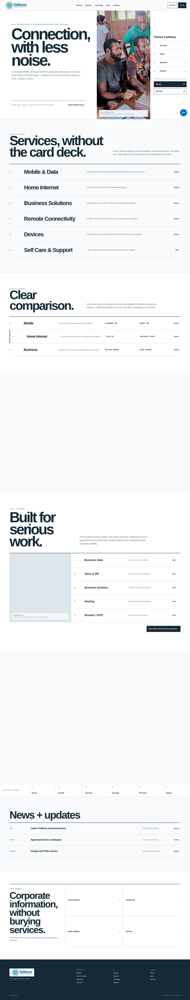](./screenshots/desktop-1440/30.jpg)

[desktop-1440](./screenshots/desktop-1440/30.jpg)

### Design 31

[Open HTML design](./31.html)

[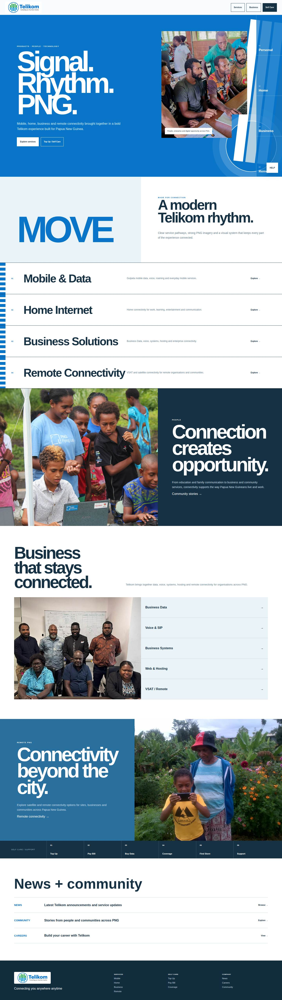](./screenshots/desktop-1440/31.jpg)

[desktop-1440](./screenshots/desktop-1440/31.jpg)

### Design 32

[Open HTML design](./32.html)

[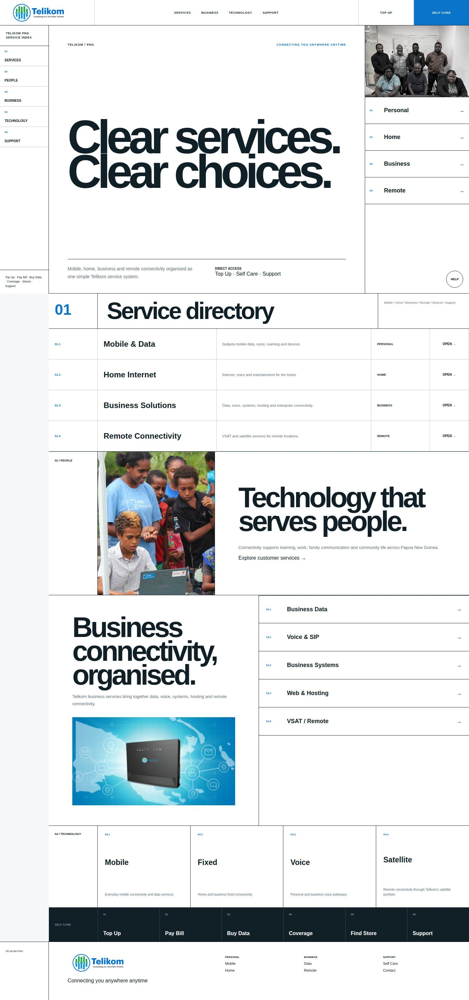](./screenshots/desktop-1440/32.jpg)

[desktop-1440](./screenshots/desktop-1440/32.jpg)

### Design 33

[Open HTML design](./33.html)

[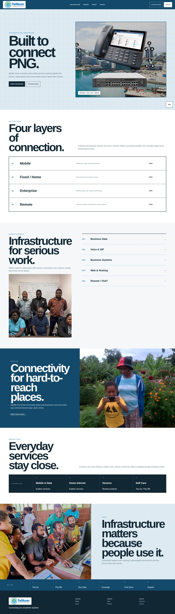](./screenshots/desktop-1440/33.jpg)

[desktop-1440](./screenshots/desktop-1440/33.jpg)

### Design 34

[Open HTML design](./34.html)

[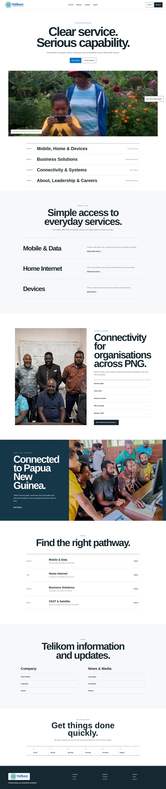](./screenshots/desktop-1440/34.jpg)

[desktop-1440](./screenshots/desktop-1440/34.jpg)

<!-- DESIGN_GALLERY_END -->
