# Telikom Page Design Competitor Research

Generated from committed competitor screenshots. Tasks remain open; these are research inputs for design.

## Services Hub

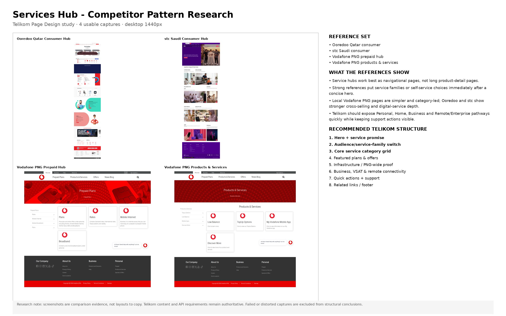

**Recommended structure:** Hero + service promise → Audience/service-family switch → Core service category grid → Featured plans & offers → Infrastructure / PNG-wide proof → Business, VSAT & remote connectivity → Quick actions + support → Related links / footer

## Personal - Mobile

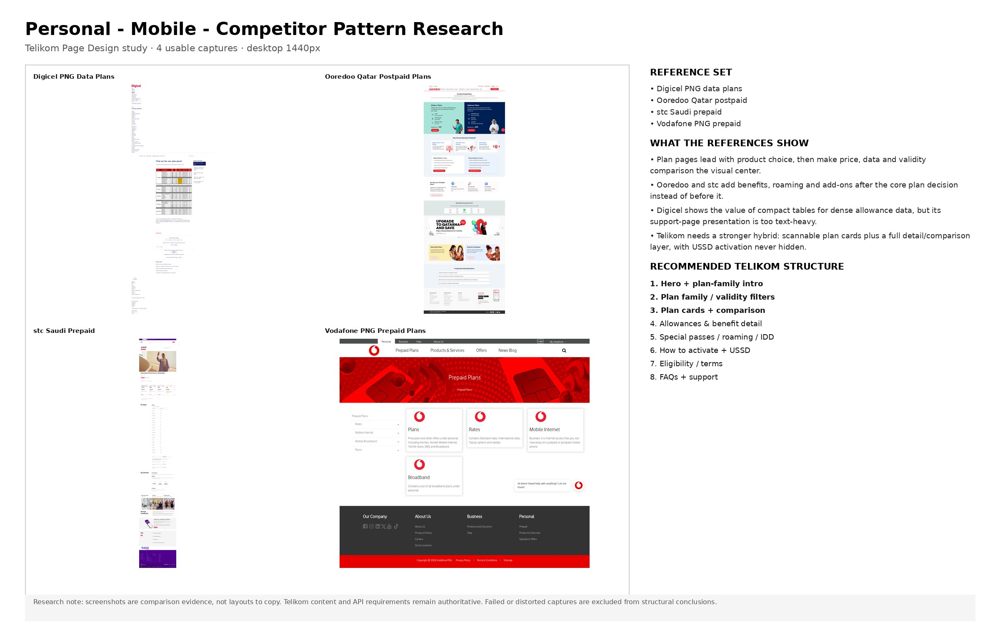

**Recommended structure:** Hero + plan-family intro → Plan family / validity filters → Plan cards + comparison → Allowances & benefit detail → Special passes / roaming / IDD → How to activate + USSD → Eligibility / terms → FAQs + support

## Affordable Home Data

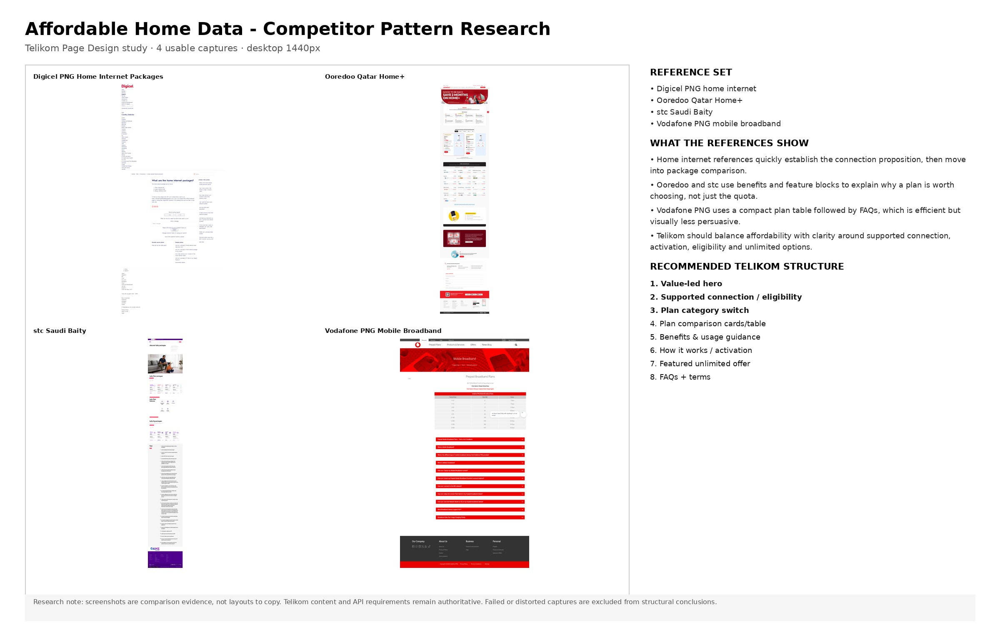

**Recommended structure:** Value-led hero → Supported connection / eligibility → Plan category switch → Plan comparison cards/table → Benefits & usage guidance → How it works / activation → Featured unlimited offer → FAQs + terms

## Special Home Passes

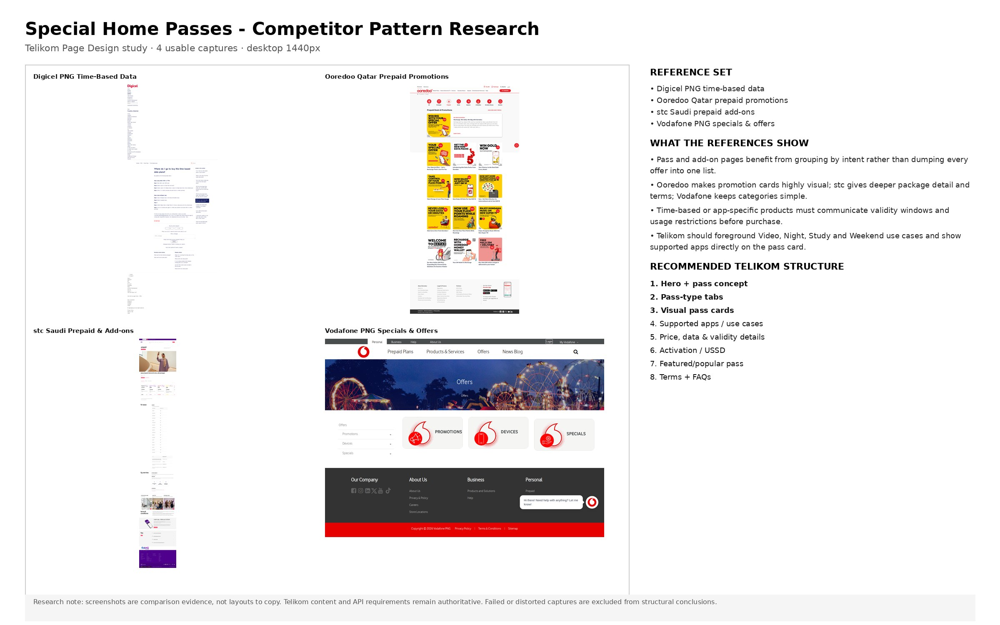

**Recommended structure:** Hero + pass concept → Pass-type tabs → Visual pass cards → Supported apps / use cases → Price, data & validity details → Activation / USSD → Featured/popular pass → Terms + FAQs

## U-TOKMoa Plans

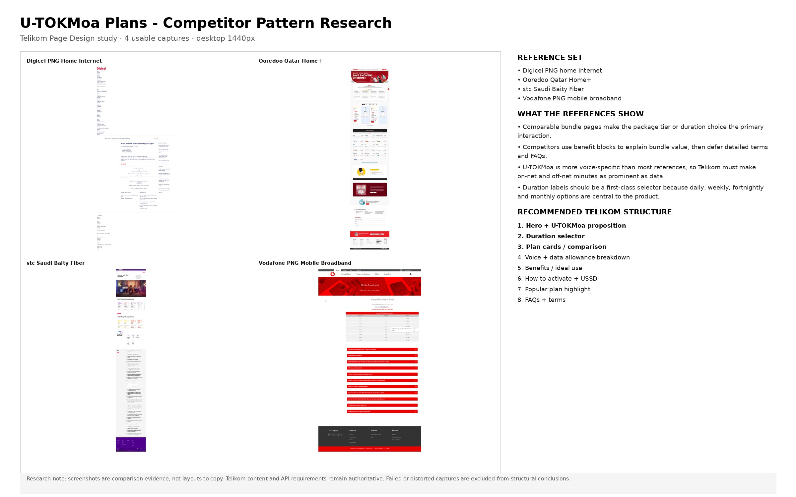

**Recommended structure:** Hero + U-TOKMoa proposition → Duration selector → Plan cards / comparison → Voice + data allowance breakdown → Benefits / ideal use → How to activate + USSD → Popular plan highlight → FAQs + terms

## Home Entertainment Package

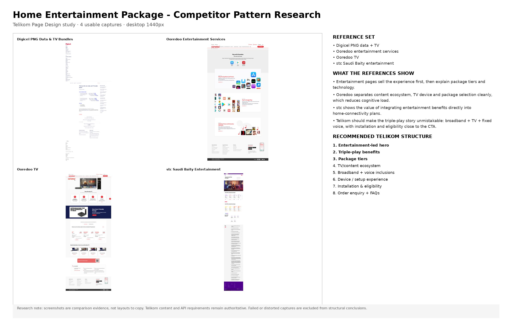

**Recommended structure:** Entertainment-led hero → Triple-play benefits → Package tiers → TV/content ecosystem → Broadband + voice inclusions → Device / setup experience → Installation & eligibility → Order enquiry + FAQs

## Devices

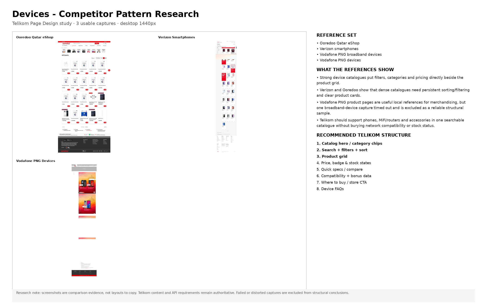

**Recommended structure:** Catalog hero / category chips → Search + filters + sort → Product grid → Price, badge & stock states → Quick specs / compare → Compatibility + bonus data → Where to buy / store CTA → Device FAQs

## Business - Fixed

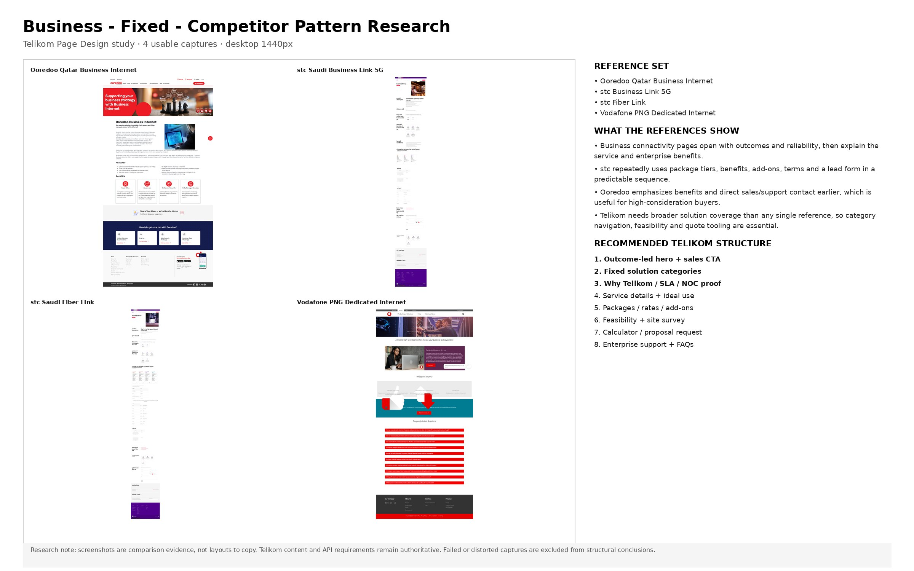

**Recommended structure:** Outcome-led hero + sales CTA → Fixed solution categories → Why Telikom / SLA / NOC proof → Service details + ideal use → Packages / rates / add-ons → Feasibility + site survey → Calculator / proposal request → Enterprise support + FAQs

## Business - Mobile

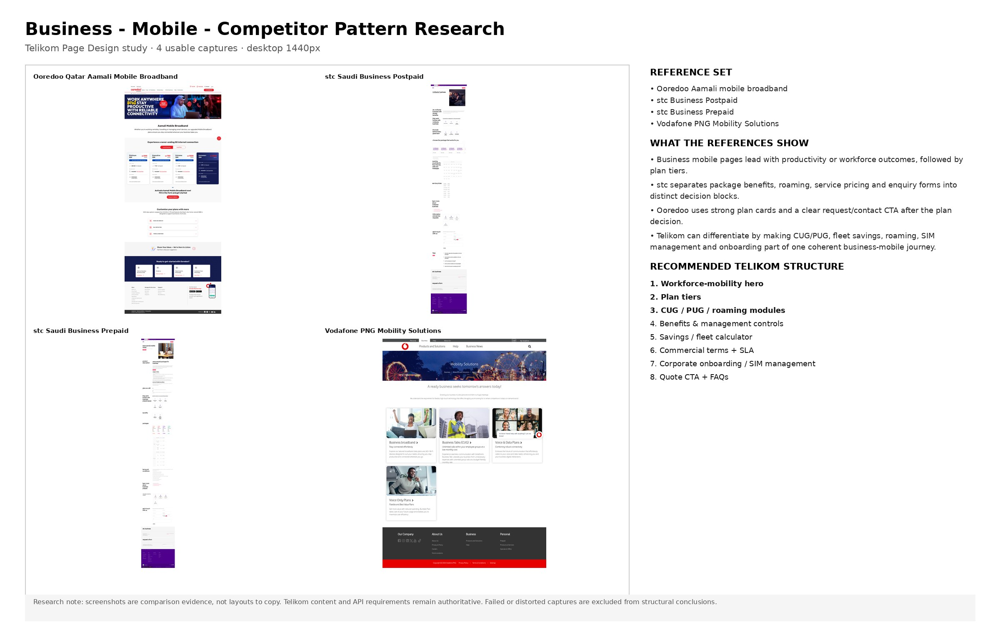

**Recommended structure:** Workforce-mobility hero → Plan tiers → CUG / PUG / roaming modules → Benefits & management controls → Savings / fleet calculator → Commercial terms + SLA → Corporate onboarding / SIM management → Quote CTA + FAQs

## News & Media

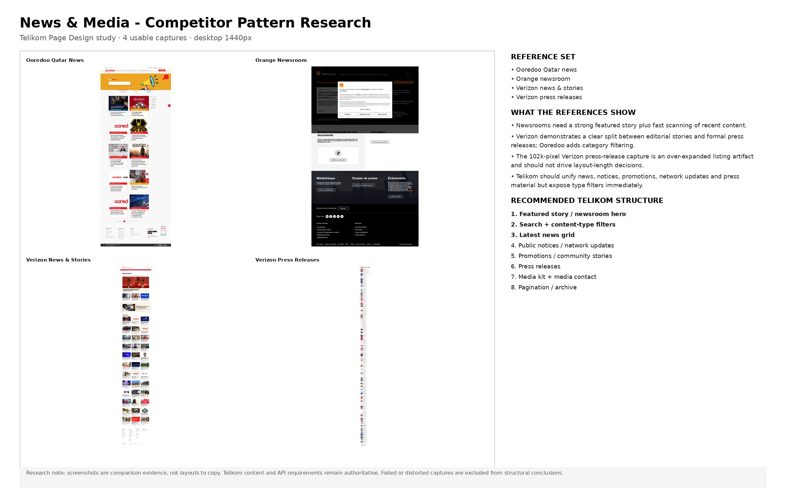

**Recommended structure:** Featured story / newsroom hero → Search + content-type filters → Latest news grid → Public notices / network updates → Promotions / community stories → Press releases → Media kit + media contact → Pagination / archive

## About Us

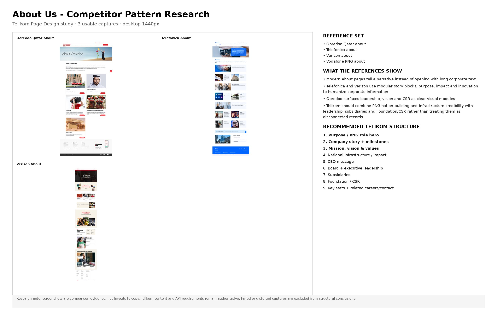

**Recommended structure:** Purpose / PNG role hero → Company story + milestones → Mission, vision & values → National infrastructure / impact → CEO message → Board + executive leadership → Subsidiaries → Foundation / CSR → Key stats + related careers/contact

## Store Locator

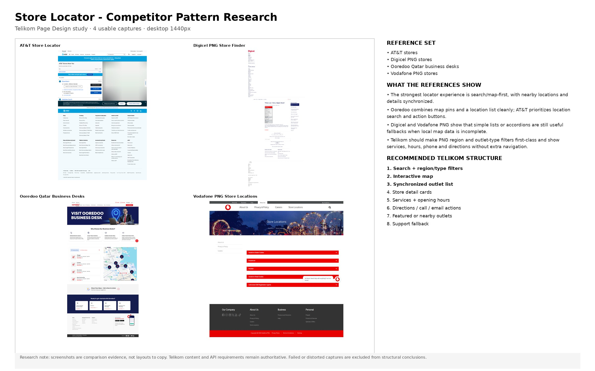

**Recommended structure:** Search + region/type filters → Interactive map → Synchronized outlet list → Store detail cards → Services + opening hours → Directions / call / email actions → Featured or nearby outlets → Support fallback

## Careers

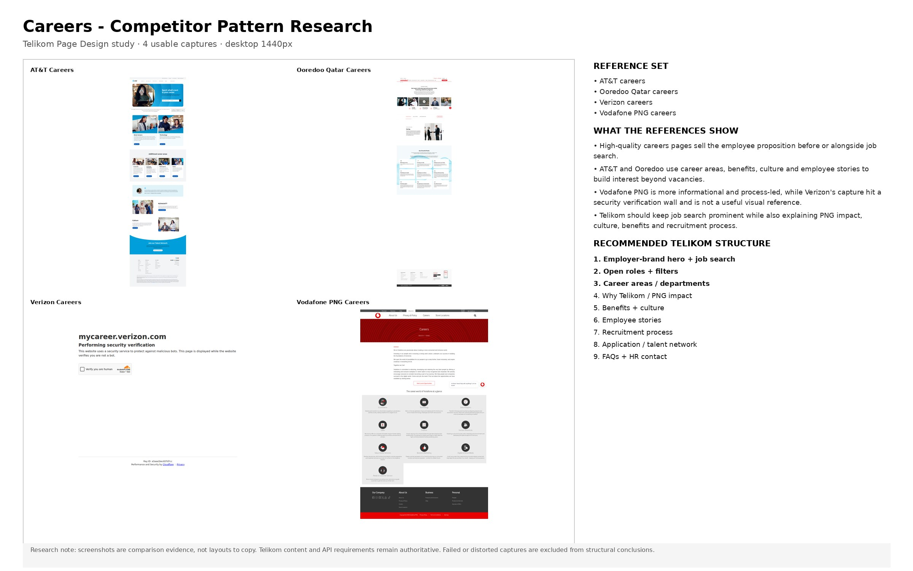

**Recommended structure:** Employer-brand hero + job search → Open roles + filters → Career areas / departments → Why Telikom / PNG impact → Benefits + culture → Employee stories → Recruitment process → Application / talent network → FAQs + HR contact

## FAQs

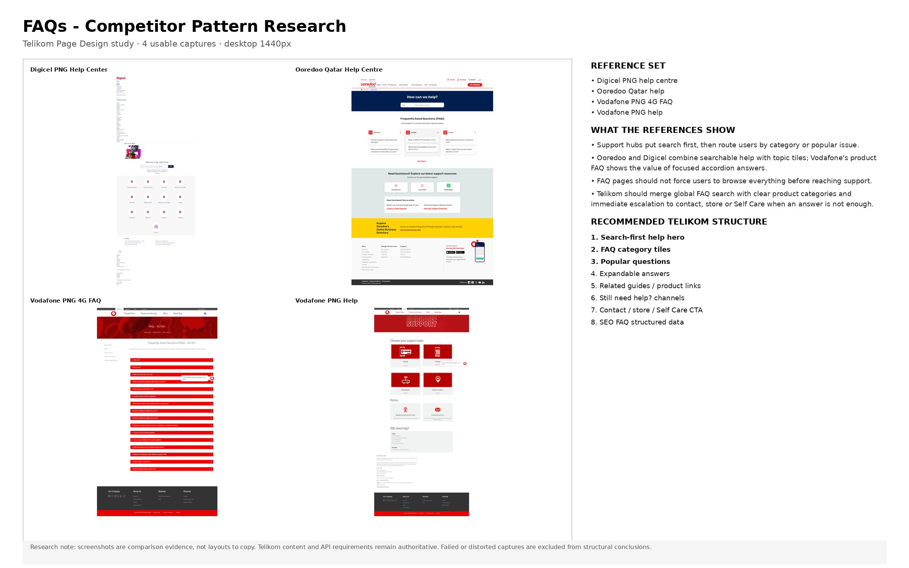

**Recommended structure:** Search-first help hero → FAQ category tiles → Popular questions → Expandable answers → Related guides / product links → Still need help? channels → Contact / store / Self Care CTA → SEO FAQ structured data

## Contact

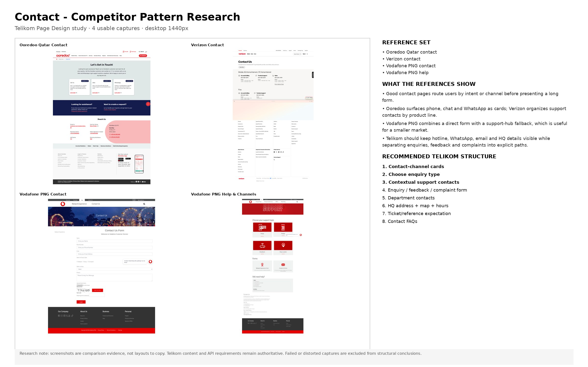

**Recommended structure:** Contact-channel cards → Choose enquiry type → Contextual support contacts → Enquiry / feedback / complaint form → Department contacts → HQ address + map + hours → Ticket/reference expectation → Contact FAQs
